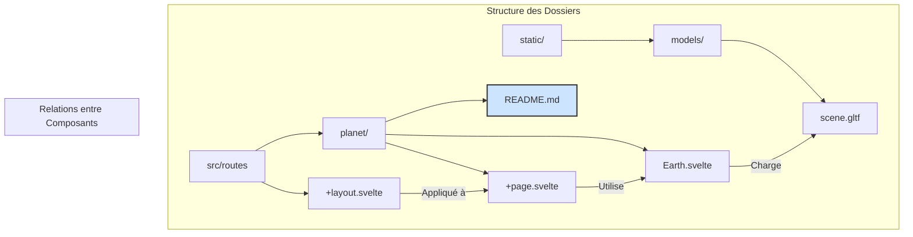

# Documentation de la Route `/planet`

Ce document explique la structure et le fonctionnement de la route `/planet` de l'application.

## Objectif

Cette route a pour but d'afficher une scène 3D contenant un modèle de planète en utilisant Svelte et la bibliothèque Threlte.

## Structure des Fichiers

Voici les fichiers clés pour cette route et leur rôle :

-   `src/routes/planet/+page.svelte`:
    -   **Rôle** : C'est le point d'entrée de la route `/planet`. Il définit la structure de la page.
    -   **Contenu** : Ce fichier met en place la scène 3D `<Canvas>` de Threlte et y insère le composant `<Earth />`.

-   `src/routes/planet/Earth.svelte`:
    -   **Rôle** : Ce composant est responsable du chargement et de l'affichage de l'objet 3D de la planète.
    -   **Fonctionnement** : Il utilise le hook `useGltf` de Threlte pour charger le modèle 3D. Le modèle est ensuite affiché dans la scène.

-   `static/models/scene.gltf`:
    -   **Rôle** : C'est le fichier du modèle 3D lui-même au format GLTF.
    -   **Emplacement** : Il est placé dans le dossier `static/models/` pour être accessible publiquement par le navigateur. Tout fichier dans `static` est servi à la racine du site. Par exemple, ce fichier est accessible à l'URL `/models/scene.gltf`.

-   `src/routes/+layout.svelte`:
    -   **Rôle** : C'est le layout principal qui s'applique à toutes les pages, y compris `/planet`.
    -   **Contenu** : Il contient les éléments communs de l'interface comme l'en-tête (`<Header />`) et le pied de page. Le contenu de la page actuelle (ici, `+page.svelte`) est inséré via la balise `<slot />`.

## Arborescence des Fichiers Pertinents

Voici l'arborescence des fichiers et dossiers importants pour le fonctionnement de cette route, montrant leur emplacement exact dans le projet.

```
/
|-- static/
|   |-- models/
|       |-- scene.gltf      <-- Le modèle 3D
|
|-- src/
    |-- routes/
        |-- +layout.svelte      <-- Le layout global
        |
        |-- planet/             <-- Le dossier de la route
            |-- +page.svelte    <-- La page Svelte
            |-- Earth.svelte    <-- Le composant 3D
            |-- README.md       <-- Ce fichier de documentation
```

## Flux de Rendu

1.  L'utilisateur accède à l'URL `/planet`.
2.  SvelteKit charge le layout `src/routes/+layout.svelte`.
3.  SvelteKit charge la page `src/routes/planet/+page.svelte` et l'insère dans le `<slot />` du layout.
4.  Le composant `+page.svelte` crée un `<Canvas>` Threlte et monte le composant `Earth.svelte`.
5.  Le composant `Earth.svelte` utilise `useGltf` pour charger le modèle depuis `/models/scene.gltf`.
6.  Une fois le modèle chargé, Threlte l'affiche dans le canvas 3D.

---

## Illustration Visuelle du Flux de Données

Voici une représentation visuelle de la manière dont les fichiers interagissent lorsqu'un utilisateur visite la page `/planet`.

```
[Navigateur Web]
      |
      | 1. Requête pour l'URL "/planet"
      v
+----------------------------------+
| SvelteKit Server                 |
|----------------------------------|
|                                  |
|  2. Trouve la route correspondante |
|     `src/routes/planet/`         |
|                                  |
+----------------------------------+
      |
      | 3. Applique le layout général
      v
+----------------------------------+         +------------------------------------+
| `src/routes/+layout.svelte`      |         | Fichiers servis statiquement       |
|----------------------------------|         |------------------------------------|
| <Header />                       |         | `static/`                          |
| <slot>  <--------------------┐   |         |   `models/`                        |
| <footer>                       |   |         |     `scene.gltf` <---------------┐ |
+----------------------------------+   |         +------------------------------------+ |
      ^                            |                                          |
      |                            |                                          |
+----------------------------------+   | 4. Injecte la page dans le slot          |
| `src/routes/planet/+page.svelte` |   |                                          |
|----------------------------------| --┘                                          |
| <Canvas>                         |                                          |
|   <Earth />  ------------------┐ |                                          |
| </Canvas>                        | | 5. Monte le composant Earth              |
+----------------------------------+ |                                          |
      ^                            |                                          |
      |                            |                                          |
+----------------------------------+ |                                          |
| `src/routes/planet/Earth.svelte` | |                                          |
|----------------------------------| <-┘                                          |
| `useGltf('/models/scene.gltf')`  | -----------------------------------------+ |
|           |                      |         6. Le client demande le modèle 3D    |
|           |                      |                                          |
|           v                      |                                          |
+----------------------------------+                                          |
      |                                                                          |
      | 7. Le modèle est chargé dans la scène 3D                                 |
      v                                                                          |
[Affichage dans le Navigateur]                                                     |
```

---

## Structure et Hiérarchie (Mermaid)

Ce diagramme Mermaid montre la hiérarchie des dossiers et les relations entre les fichiers clés de la route `/planet`.



Cette structure permet de garder le code modulaire et facile à maintenir. Le composant `Earth.svelte` est réutilisable, et la page `+page.svelte` se contente d'orchestrer l'affichage.